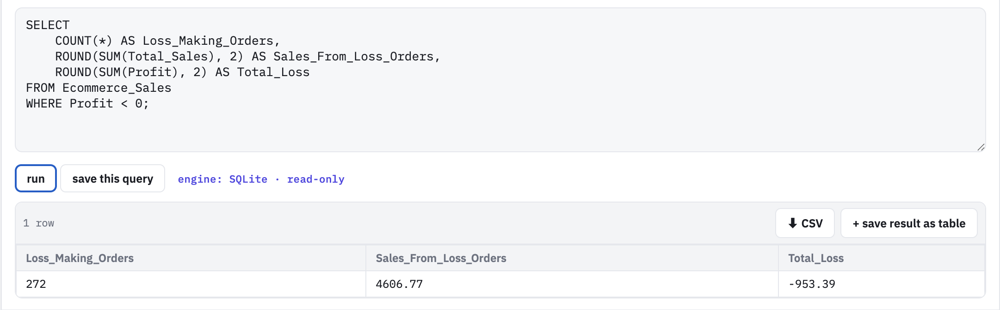
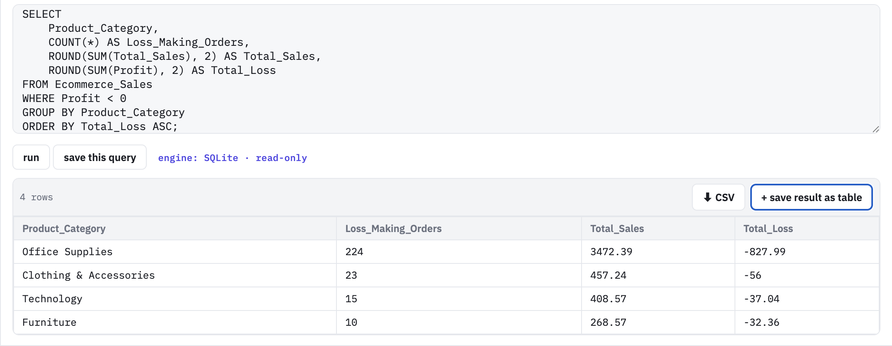
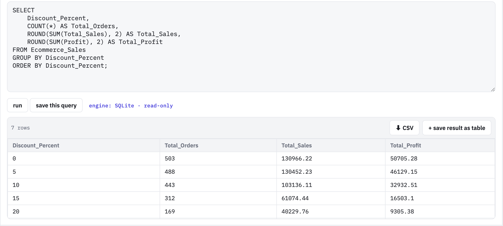
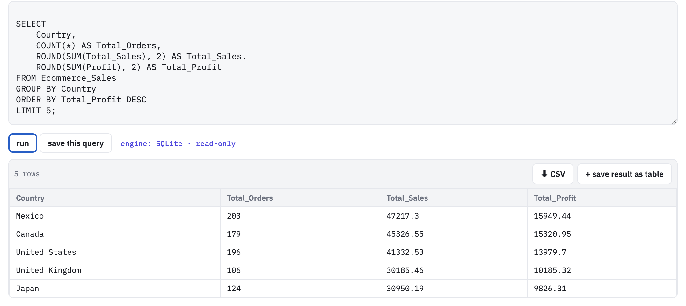
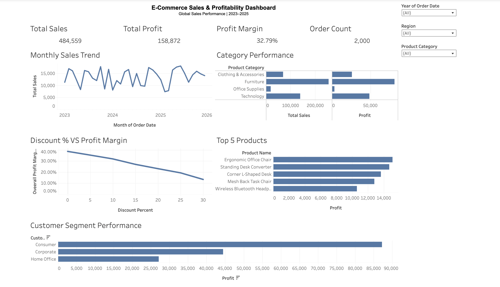

# E-Commerce Sales & Profitability Analysis

## Overview

This project analyses a global e-commerce dataset containing 2,000 transactions from 2023 to 2025. The objective was to evaluate sales and profitability performance, identify key profit drivers, investigate loss-making transactions, and understand how factors such as discounts, product categories and customer segments affect business performance.

The analysis was completed using **Excel, SQL and Tableau**, demonstrating an end-to-end data analytics workflow from data preparation and exploratory analysis through to SQL querying and interactive dashboard development.

---

## Business Questions

The analysis was designed to answer the following questions:

- What are the overall sales, profit and profit margin?
- Which product categories generate the most sales and profit?
- Which products generate the highest profit?
- Which customer segments contribute the most profit?
- How does discounting affect profitability?
- How many transactions are loss-making?
- Which product categories account for the largest losses?
- Which countries generate the highest profit?

---

## Tools Used

### Excel
Used for data preparation, validation and initial exploratory analysis.

### SQL (SQLite)
Used to query the dataset and investigate profitability, product performance, customer segments, discount behaviour and loss-making transactions.

### Tableau
Used to create an interactive sales and profitability dashboard with KPI cards, visual analysis and dynamic filters.

---

## Dataset

The dataset contains **2,000 global e-commerce transactions** covering the period **2023–2025**.

Key fields include:

- Order Date
- Country
- Region
- Product Category
- Product Name
- Customer Segment
- Quantity
- Unit Price
- Discount Percent
- Total Sales
- Profit

The raw CSV dataset is available in the `data` folder and the Excel version used during analysis is available in the `excel` folder.

---

## Key Performance Indicators

| KPI | Result |
|---|---:|
| Total Sales | 484,559.34 |
| Total Profit | 158,872.32 |
| Profit Margin | 32.79% |
| Order Count | 2,000 |

---

## SQL Analysis

SQL was used to investigate several areas of business performance.

### 1. Loss-Making Transactions

The analysis identified **272 loss-making transactions**, representing **4,606.77 in sales** and generating a combined loss of **953.39**.



### 2. Losses by Product Category

Office Supplies represented the largest source of loss-making activity, accounting for **224 loss-making transactions** and approximately **827.99 in losses**.

This indicates that although the overall business is profitable, specific areas within the product portfolio require closer monitoring.



### 3. Discount Performance

Discount analysis showed a clear deterioration in profitability as discount levels increased.

Orders with **0% discount generated 50,705.28 in profit**, while profitability progressively declined as discounts increased.

This suggests that discount strategy is an important driver of overall profitability.



### 4. Product Performance

Products were ranked by total profit to identify the strongest individual contributors to profitability.



### 5. Customer Segment Performance

Customer segment analysis showed that the **Consumer segment** generated the highest overall profit, followed by Corporate and Home Office customers.

### 6. Geographic Performance

Country-level analysis identified the strongest markets by total profit.

Among the leading countries were:

| Country | Orders | Sales | Profit |
|---|---:|---:|---:|
| Mexico | 203 | 47,217.30 | 15,949.44 |
| Canada | 179 | 45,326.55 | 15,320.95 |
| United States | 196 | 41,332.53 | 13,979.70 |
| United Kingdom | 106 | 30,185.46 | 10,185.32 |
| Japan | 124 | 30,950.19 | 9,826.31 |

---

## Tableau Dashboard

An interactive Tableau dashboard was developed to provide a consolidated view of business performance.

The dashboard includes:

- Total Sales
- Total Profit
- Profit Margin
- Order Count
- Monthly Sales Trend
- Category Performance
- Discount % vs Profit Margin
- Top 5 Products
- Customer Segment Performance
- Year, Region and Product Category filters



---

## Key Insights

The analysis produced several important findings:

1. The business generated **484,559.34 in sales** and **158,872.32 in profit**, resulting in an overall **32.79% profit margin**.

2. Furniture was the strongest product category by both overall sales and profit.

3. The Consumer customer segment generated the highest overall profit.

4. Higher discount levels were associated with substantially lower profitability.

5. **272 transactions were loss-making**, although their combined loss represented a relatively small proportion of overall business profit.

6. Office Supplies accounted for the majority of loss-making transactions identified through SQL analysis.

7. Mexico generated the highest country-level profit within the geographic analysis.

---

## Business Recommendations

Based on the analysis, the business should:

- Review the pricing and discount strategy for heavily discounted products.
- Investigate loss-making Office Supplies transactions to identify specific products or pricing issues.
- Prioritise high-performing products and categories when making inventory and marketing decisions.
- Continue developing the Consumer segment while identifying opportunities to improve Corporate and Home Office profitability.
- Monitor profitability alongside sales rather than using revenue alone as the primary measure of product performance.
- Use geographic profitability analysis to support market-specific sales and marketing decisions.

---

## Skills Demonstrated

- Data Cleaning & Preparation
- Microsoft Excel
- SQL / SQLite
- Tableau
- Data Visualisation
- KPI Development
- Profitability Analysis
- Customer Segmentation
- Product Performance Analysis
- Exploratory Data Analysis
- Business Insight Generation
- Data-Driven Recommendations

---

## Repository Structure

```text
Ecommerce_Sales_Profitability_Analysis/
│
├── data/
│   └── Ecommerce_Sales_Data.csv
│
├── excel/
│   └── Ecommerce_Sales_Data.xlsx
│
├── sql/
│   └── Ecommerce_Sales_SQL_Analysis.sql
│
├── images/
│   ├── SQL_Category_Losses.png
│   ├── SQL_Discount_Performance.png
│   ├── SQL_Loss_Making_Orders.png
│   ├── SQL_Top5_Products.png
│   └── Tableau_Dashboard.png
│
└── README.md
